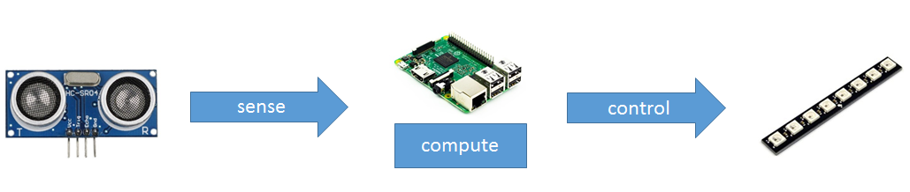
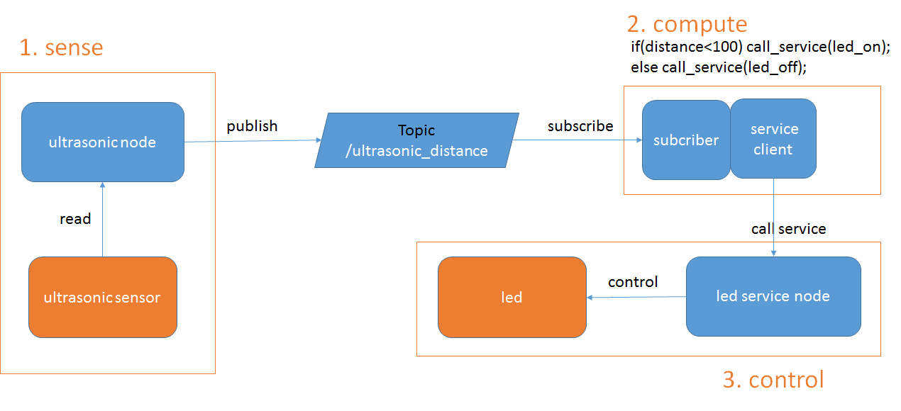

# Making an ultrasonic sensor light

> This tutorial covers how to make nodes communicating with other nodes.</br>
> Prerequisites: Raspberry PI3(ROS installed), ultrasonic sensor(us-100), led(NS-LED-2)

---

## Overview

Let's make a sensor light which can automatically turn on when something is close to the sensor.

We will make following nodes:

1. A sensing node: This node will sense the distance and publish the distance data. (Publisher)
1. A computing node: This node will subscribe the published distance data and decide the led status and then send a request to control node. (Subscriber, Service client)
1. A controlling node: This node will control the led when other nodes send a request. (Service server)




---

## Creating a package

In your catkin sourcespace, use the catkin_create_pkg script to create a new package called 'pi' which depends on roscpp, message_generation,message_runtime, sensor_msgs:

```no
catkin_create_pkg pi roscpp message_generation message_runtime visualization_msgs sensor_msgs
```

* meesage_generation and message_runtime are for the communication.
* sensor_msgs is the data type which we will send and receive.

---

## the sensing node

~/catkin_ws/src/pi/src/ultrasonic.cpp:

```cpp
#include "ros/ros.h"
#include "sensor_msgs/Range.h"
#include <stdio.h>
#include <wiringPi.h>

#define trig_pin 8  //header 3
#define echo_pin 9  //header 5

float read(){
    int time=0;
    float dist=0;
    digitalWrite(trig_pin,LOW);
    delayMicroseconds(2);
    digitalWrite(trig_pin,HIGH);
    delayMicroseconds(10);
    digitalWrite(trig_pin,LOW);

    while((digitalRead(echo_pin)==0)&&time<60000){
        time++;
        delayMicroseconds(1);
    }
    time=0;
    while((digitalRead(echo_pin)==1)&&time<60000){
        time++;
        delayMicroseconds(1);
    }
    dist = (time*0.1657);
    if(dist>5000 || dist==0) return -1;

    return dist/1000;
}
int main(int argc, char **argv)
{

    setenv("WIRINGPI_GPIOMEM","1",1);
    wiringPiSetup();
    pinMode(trig_pin,OUTPUT);
    pinMode(echo_pin,INPUT);

    ros::init(argc, argv, "ultrasonic");
    ros::NodeHandle n;
    ros::Publisher dist_pub = n.advertise<sensor_msgs::Range>("ultrasonic_distance",10);
    ros::Rate loop_rate(10);

    while(ros::ok())
    {
        sensor_msgs::Range msg;

        msg.header.frame_id = "ultrasonic";
        msg.radiation_type = msg.ULTRASOUND;
        msg.field_of_view = 0.5;
        msg.min_range=0.02; //2cm
        msg.max_range=3.0; //60cm
        msg.range = read();
        msg.header.stamp=ros::Time::now();
        dist_pub.publish(msg);
        if(msg.range==-1) ROS_INFO("distance = out of range");
        else ROS_INFO("distance = %fm", msg.range);

        ros::spinOnce();
        loop_rate.sleep();
    }
    return 0;
}
```

---

## the controlling node

~/catkin_ws/src/pi/src/ws2812b.cpp:

```cpp
#include <stdio.h>
#include <sys/types.h>
#include <fcntl.h>
#include <linux/kdev_t.h>
#include <linux/kernel.h>
#include <linux/fs.h>
#include <unistd.h>
#include <sys/stat.h>
#include <stdint.h>
#include "ws2812b.h"

static int ws2812b_fd;
static ws2812b_led s_led[MAX_NUM_OF_LEDS_PER_WS2812B_MODULE] ={0,};
int ws2812b_setup(void)
{
    mknod(DEV_NAME,S_IRWXU|S_IRWXG|S_IFCHR,(DEV_LED_MAJOR_NUMBER<<8)|DEV_LED_MINOR_NUMBER);

    if((ws2812b_fd = open(DEV_NAME, O_RDWR | O_NONBLOCK)) < 0){
        perror("open()");
        return -1;
    }else
        printf("LED Device Driver Open Sucess!\n"); 

    return 0;
}
void ws2812b_close(void)
{
    close(ws2812b_fd);
}
int ws2812b_set_led(int index, int color, int brightness)
{
    int ret = -1;
    ws2812b_led led[MAX_NUM_OF_LEDS_PER_WS2812B_MODULE] ={0,};

    s_led[index].index      = led[index].index        = index;
    s_led[index].rgb        = led[index].rgb          = (color > 0xffffff) ? 0xffffff : color;
    s_led[index].brightness = led[index].brightness   = (brightness > 255) ? 255 : brightness;

    if((ret = write(ws2812b_fd, led, sizeof(ws2812b_led)*MAX_NUM_OF_LEDS_PER_WS2812B_MODULE))<0)
        return -1;

#ifdef LED_PRINT
    printf("led index : %d RGB : %x Brightness : %x\n",index,led[index].rgb,led[index].brightness);
#endif
    return 0;
}
int ws2812b_set_static_led(int index, int color, int brightness)
{
    int ret = -1;
    if(index > MAX_NUM_OF_LEDS_PER_WS2812B_MODULE) return -1;

    s_led[index].index        = index;
    s_led[index].rgb          = (color > 0xffffff) ? 0xffffff : color;
    s_led[index].brightness   = (brightness > 255) ? 255 : brightness;

    if((ret = write(ws2812b_fd, s_led, sizeof(ws2812b_led)*MAX_NUM_OF_LEDS_PER_WS2812B_MODULE))<0)
        return -1;

#ifdef LED_PRINT
    printf("led index : %d RGB : %x Brightness : %x\n",index,s_led[index].rgb,s_led[index].brightness);
#endif
    return 0;
}
int ws2812b_clear_led(void)
{
    int i,ret = -1;
    for(i=0; i <MAX_NUM_OF_LEDS_PER_WS2812B_MODULE; i++){
        s_led[i].index        = 0;
        s_led[i].rgb          = 0;
        s_led[i].brightness   = 0;
    }

    if((ret = write(ws2812b_fd, s_led, sizeof(ws2812b_led)*MAX_NUM_OF_LEDS_PER_WS2812B_MODULE))<0)
        return -1;
    return 0;
}
```

~/catkin_ws/src/pi/src/led.cpp:

```cpp
#include "ros/ros.h"
#include "pi/led.h" //service
#include "visualization_msgs/Marker.h"
#include "visualization_msgs/MarkerArray.h" //message for publication

#include <stdio.h>
#include <stdlib.h>
#include <unistd.h>
#include <stdint.h>
#include "ws2812b.h"

visualization_msgs::MarkerArray markerArray;

bool setLed(pi::led::Request &req, pi::led::Response &res){
    res.led_id=req.led_id;
    res.color=req.color;
    res.brightness=req.brightness;

    ws2812b_set_static_led(req.led_id,req.color,req.brightness);
    ROS_INFO("req : id=%d, color=%d, brightness=%d",req.led_id,req.color,req.brightness);
    ROS_INFO("res : id=%d, color=%d, brightness=%d",res.led_id,res.color,res.brightness);
    visualization_msgs::Marker marker;

    marker.header.frame_id = "led_link";
    marker.header.stamp = ros::Time();
    marker.ns = "led_namespace";
    marker.id = req.led_id;
    marker.type = visualization_msgs::Marker::SPHERE;
    marker.action = visualization_msgs::Marker::MODIFY;
    marker.pose.position.x = 0.0015;
    marker.pose.position.y = 0.0315-(0.009*req.led_id);
    marker.pose.position.z = 0;
    marker.pose.orientation.x = 0.0;
    marker.pose.orientation.y = 0.0;
    marker.pose.orientation.z = 0.0;
    marker.pose.orientation.w = 1.0;
    marker.scale.x = 0.005*(req.brightness/255);
    marker.scale.y = 0.005*(req.brightness/255);
    marker.scale.z = 0.005*(req.brightness/255);
    marker.color.a = 1.0; // Don't forget to set the alpha!
    marker.color.r = ((req.color>>16)&0xFF);
    marker.color.g = ((req.color>>8)&0xFF);
    marker.color.b = (req.color&0xFF);
    marker.mesh_resource = "package://pr2_description/meshes/base_v0/base.dae";
    markerArray.markers[req.led_id]=marker;
    return true;
}
int main(int argc, char **argv)
{
    if(ws2812b_setup()<0){
        printf("ws2812b error");
        return 1;
    }
    else printf("ws2812b setup ok \n");

    ros::init(argc, argv, "led");

    ros::NodeHandle n;

    ros::ServiceServer service = n.advertiseService("led", setLed);

    ROS_INFO("ready led service server");

    ros::NodeHandle nh_pub;
    ros::Publisher vis_pub = nh_pub.advertise<visualization_msgs::MarkerArray>( "visualization_markers", 10 );
    ros::Rate loop_rate(10);

    //initialize led
    markerArray.markers.resize(8);
    for(int i =0;i<8; i++){
        visualization_msgs::Marker marker;

        marker.header.frame_id = "led_link";
        marker.header.stamp = ros::Time();
        marker.ns = "led_namespace";
        marker.id = i;
        marker.type = visualization_msgs::Marker::SPHERE;
        marker.action = visualization_msgs::Marker::ADD;
        marker.pose.position.x = 0.0015;
        marker.pose.position.y = 0.0315-(0.009*i);
        marker.pose.position.z = 0;
        marker.pose.orientation.x = 0.0;
        marker.pose.orientation.y = 0.0;
        marker.pose.orientation.z = 0.0;
        marker.pose.orientation.w = 1.0;
        marker.scale.x = 0.000;
        marker.scale.y = 0.000;
        marker.scale.z = 0.000;
        marker.color.a = 1.0; // Don't forget to set the alpha!
        marker.color.r = 0.0;
        marker.color.g = 0.0;
        marker.color.b = 0.0;
        marker.mesh_resource = "package://pr2_description/meshes/base_v0/base.dae";
        markerArray.markers[i]=marker;
        ws2812b_set_static_led(i,0,0);
    }

    while(ros::ok())
    {
        vis_pub.publish( markerArray );
        ros::spinOnce();
        loop_rate.sleep();
    }
    return 0;
}
```

~/catkin_ws/src/pi/srv/led.srv:

```no
int8 led_id
int32 color
int16 brightness
---
int8 led_id
int32 color
int16 brightness
```

---

## the computing node

~/catkin_ws/src/pi/src/distance_to_led.cpp:

```cpp
#include "ros/ros.h"
#include "pi/led.h"
#include "sensor_msgs/Range.h"


ros::ServiceClient sc;
pi::led srv;
void callback(const sensor_msgs::Range::ConstPtr& msg)
{
  ROS_INFO("distance = %fm", msg->range);
  srv.request.led_id=5;
  srv.request.color=(msg->range<0.3)? 255:65280;
  srv.request.brightness=255;
  if((srv.request.led_id!=srv.response.led_id)||(srv.request.color!=srv.response.color)||(srv.request.brightness!=srv.response.brightness)){
      if(sc.call(srv))
      {
          ROS_INFO("req : id=%d, color=%ld, brightness=%d",srv.request.led_id,srv.request.color,srv.request.brightness);
          ROS_INFO("res : id=%d, color=%ld, brightness=%d",srv.response.led_id,srv.response.color,srv.response.brightness);
      }
      else{
          ROS_ERROR("Failed to call service");
      }
  }
}
int main(int argc, char **argv)
{
  ros::init(argc, argv, "distance_to_led");

  ros::NodeHandle n;
  ros::Subscriber sub = n.subscribe("ultrasonic_distance", 1000, callback);

   ros::NodeHandle scn;

  sc=scn.serviceClient<pi::led>("led");

  ros::spin();

  return 0;
}
```

---

## package.xml

```xml
<?xml version="1.0"?>
<package format="2">
  <name>pi</name>
  <version>0.0.0</version>
  <description>The pi package</description>

  <maintainer email="aloe@todo.todo">aloe</maintainer>

  <license>TODO</license>

  <buildtool_depend>catkin</buildtool_depend>

  <build_depend>message_generation</build_depend>
  <build_depend>message_runtime</build_depend>
  <build_depend>roscpp</build_depend>
  <build_depend>sensor_msgs</build_depend>
  <build_depend>visualization_msgs</build_depend>

  <build_export_depend>message_generation</build_export_depend>
  <build_export_depend>message_runtime</build_export_depend>
  <build_export_depend>roscpp</build_export_depend>
  <build_export_depend>sensor_msgs</build_export_depend>
  <build_export_depend>visualization_msgs</build_export_depend>

  <exec_depend>message_generation</exec_depend>
  <exec_depend>message_runtime</exec_depend>
  <exec_depend>roscpp</exec_depend>
  <exec_depend>sensor_msgs</exec_depend>
  <exec_depend>visualization_msgs</exec_depend>
  <export>

  </export>
</package>

```

---

## CMakeLists.txt

```CMake
cmake_minimum_required(VERSION 2.8.3)
project(pi)

find_package(catkin REQUIRED COMPONENTS
  message_generation
  message_runtime
  roscpp
  visualization_msgs
  sensor_msgs
)

add_service_files(FILES led.srv)

generate_messages(
  DEPENDENCIES
  sensor_msgs
  visualization_msgs
)

catkin_package(
#  INCLUDE_DIRS include
  LIBRARIES pi
  CATKIN_DEPENDS message_generation message_runtime roscpp sensor_msgs visualization_msgs
#  DEPENDS system_lib
)


include_directories(
# include
  ${catkin_INCLUDE_DIRS}
)

add_executable(led src/ws2812b.cpp src/led.cpp)
add_dependencies(led ${${PROJECT_NAME}_EXPORTED_TARGETS} ${catkin_EXPORTED_TARGETS})
target_link_libraries(led ${catkin_LIBRARIES})

add_executable(ultrasonic src/ultrasonic.cpp)
add_dependencies(ultrasonic ${${PROJECT_NAME}_EXPORTED_TARGETS} ${catkin_EXPORTED_TARGETS})
target_link_libraries(ultrasonic ${catkin_LIBRARIES} wiringPi)

add_executable(distance_to_led src/distance_to_led.cpp)
add_dependencies(distance_to_led ${${PROJECT_NAME}_EXPORTED_TARGETS} ${catkin_EXPORTED_TARGETS})
target_link_libraries(distance_to_led ${catkin_LIBRARIES})
```