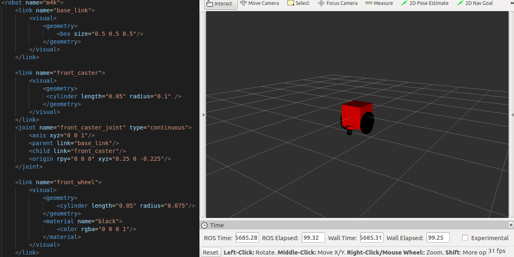

# Modeling your robot in URDF

> This tutorial covers how to model a differential wheeled robot

---

## URDF

The Unified Robot Description Format (URDF) is an XML file format used in ROS to describe all elements of a robot.


---

## Standard Units of Measure and Coordinate Conventions

| Quantity | Unit     | Quantity    | Unit    |
| -------- | -------- | ----------- | ------- |
| length   | meter    | angle       | radian  |
| mass     | kilogram | frequency   | hertz   |
| time     | second   | force       | newton  |
| current  | ampere   | power       | watt    |
| voltage  | volt     | temperature | celsius |

</br>

* x: forward
* y: left
* z: up

---

## Joint and link

* A link is a rigid body, such as a chassis or a wheel.
* A joint connects two links, defining how they can move with respect to each other.

Joint types supported by URDF

| Name       | Description                                                                            |
| ---------- | -------------------------------------------------------------------------------------- |
| continuous | A joint that can rotate indefinitely about a single axis                               |
| revolute   | Like a continuous joint, but with upper and lower angle limits                         |
| prismatic  | A joint that slides linearly along a single axis, with upper and lower position limits |
| planar     | A joint that allows translation and rotation perpendicular to a plane                  |
| floating   | A joint that allows full six-dimensional translation and rotation                      |
| fixed      | A special joint type that allows no motion                                             |

---

## Modeling a differential wheeled robot

We need a new package. Let's create a new package.

```no
cd ~/catkin_ws/src/
catkin_create_pkg m4k_description
```

To model a differential wheeled robot, we need to represent its essential components:

* One chassis
* Left wheel and right wheel
* Front caster and rear caster
* Front wheel and rear wheel

Let's start with the chassis</br>
~/catkin_ws/src/m4k_description/urdf/m4k.urdf:

```xml
<?xml version="1.0"?>
<robot name="m4k">
    <link name="base_link">
        <visual>
            <geometry>
                <box size="0.5 0.5 0.5"/>
            </geometry>
        </visual>
    </link>
</robot>
```

To see what we've created, create display.launch</br>
~/catkin_ws/src/m4k_description/launch/display.launch:

```xml
<launch>
 <arg name="model" default="$(find m4k_description)/urdf/m4k.urdf" />
 <arg name="gui" default="False" />

 <param name="robot_description" textfile="$(arg model)" />
 <param name="use_gui" value="$(arg gui)"/>

 <node name="joint_state_publisher" pkg="joint_state_publisher" type="joint_state_publisher" />
 <node name="robot_state_publisher" pkg="robot_state_publisher" type="state_publisher" />
 <node name="rviz" pkg="rviz" type="rviz" args="-d $(find m4k_description)/m4k.rviz" required="true" />
</launch>
```

then run:

```no
roslaunch m4k_description display.launch
```

You should see rviz pop up. If you can not see a box image in RViz,

1. Click add button -> rviz/RobotModel -> Ok button
1. Change `fixed frame` to `base_link`


Now we have one chassis. Let's add the front_caster</br>

~/catkin_ws/src/m4k_description/launch/display.launch:

```xml
<?xml version="1.0"?>
<robot name="m4k">
    <link name="base_link">
        <visual>
            <geometry>
                <box size="0.5 0.5 0.5"/>
            </geometry>
        </visual>
    </link>

    <link name="front_caster">
        <visual>
            <geometry>
             <cylinder length="0.05" radius="0.1" />
            </geometry>
            <material name="silver"/>
        </visual>
    </link>
    <joint name="front_caster_joint" type="continuous">
        <axis xyz="0 0 1"/>
        <parent link="base_link"/>
        <child link="front_caster"/>
        <origin rpy="0 0 0" xyz="0.25 0 -0.225"/>
    </joint>
</robot>
```

To check whether the joint is working correctly run the script and add TF in RViz:

```no
roslaunch m4k_description display.launch gui:=true
```


Now we have seen how to add links and joints. Let's add other components.

~/catkin_ws/src/m4k_description/launch/display.launch:

```xml
<?xml version="1.0"?>
<robot name="m4k">
    <link name="base_link">
        <visual>
            <geometry>
                <box size="0.5 0.5 0.5"/>
            </geometry>
        </visual>
    </link>

    <link name="front_caster">
        <visual>
            <geometry>
             <cylinder length="0.05" radius="0.1" />
            </geometry>
            <material name="silver"/>
        </visual>
    </link>
    <joint name="front_caster_joint" type="continuous">
        <axis xyz="0 0 1"/>
        <parent link="base_link"/>
        <child link="front_caster"/>
        <origin rpy="0 0 0" xyz="0.25 0 -0.225"/>
    </joint>

    <link name="front_wheel">
        <visual>
            <geometry>
                <cylinder length="0.05" radius="0.075"/>
            </geometry>
            <material name="black"/>
        </visual>
    </link>
    <joint name="front_wheel_joint" type="continuous">
        <axis xyz="0 0 1"/>
        <parent link="front_caster"/>
        <child link="front_wheel"/>
        <origin rpy="-1.5708 0 0" xyz="0.05 0 -0.1"/>
    </joint>

    <link name="rear_caster">
        <visual>
            <geometry>
             <cylinder length="0.05" radius="0.1" />
            </geometry>
            <material name="silver"/>
        </visual>
    </link>
    <joint name="rear_caster_joint" type="continuous">
        <axis xyz="0 0 1"/>
        <parent link="base_link"/>
        <child link="rear_caster"/>
        <origin rpy="0 0 0" xyz="-0.25 0 -0.225"/>
    </joint>

    <link name="rear_wheel">
        <visual>
            <geometry>
                <cylinder length="0.05" radius="0.075"/>
            </geometry>
            <material name="black"/>
        </visual>
    </link>
    <joint name="rear_wheel_joint" type="continuous">
        <axis xyz="0 0 1"/>
        <parent link="rear_caster"/>
        <child link="rear_wheel"/>
        <origin rpy="-1.5708 0 0" xyz="-0.05 0 -0.1"/>
    </joint>


    <link name="right_wheel">
        <visual>
            <geometry>
             <cylinder length="0.05" radius="0.25"/>
            </geometry>
            <material name="black">
            <color rgba="0 0 0 1"/>
            </material>
        </visual>
    </link>
    <joint name="right_wheel_joint" type="continuous">
        <axis xyz="0 0 1"/>
        <parent link="base_link"/>
        <child link="right_wheel"/>
        <origin rpy="-1.5708 0 0" xyz="0 -0.275 -0.15"/>
    </joint>
    <link name="left_wheel">
        <visual>
            <geometry>
               <cylinder length="0.05" radius="0.25"/>
            </geometry>
            <material name="black"/>
        </visual>
    </link>
    <joint name="left_wheel_joint" type="continuous">
        <axis xyz="0 0 1"/>
        <parent link="base_link"/>
        <child link="left_wheel"/>
        <origin rpy="-1.5708 0 0" xyz="0 0.275 -0.15"/>
    </joint>
</robot>
```


Finally, we have the differential wheeled robot.</br>